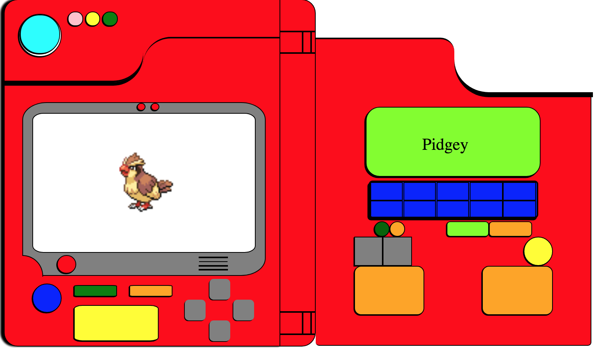

<h1> Markup Pokedex </h1>

HTML/CSS PokeDex that connects to PokeAPI and allows a user to select through all of gen-1 pokemon.
Currently supports the left/right button pad in order to select Pokemon. 

<h2> Setup instructions </h2>

<h3> Option A </h3>

Ensure you have npm and git installed.

`git clone` the repository.

Navigate to the /app directory.

Install the packages via:
`npm install` 

Build webpack via:
`npm run make` 

Ensure you have redis installed; and launch `redis-server` on port 6379

Local env variable is required. Need to set `Redis`, e.g.  `export REDIS="redis://localhost:6379"`

Express server launched via:
`npm run server` 

<h3> Docker Option </h3>

The solution can be run via the docker implementation.

Steps: 

Install docker and docker-compose.

Run `docker-compose build` in root directory.

Run `docker-compose up` to launch the solution

